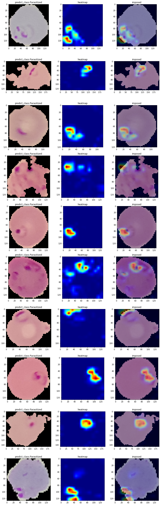
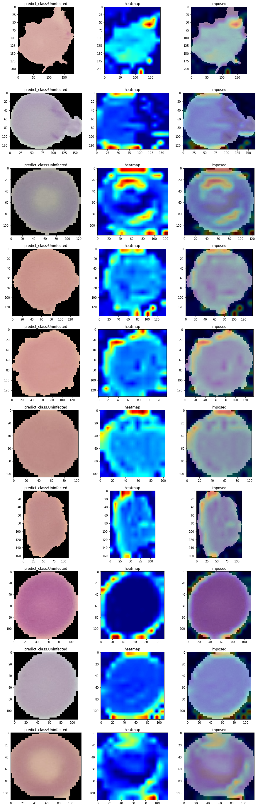
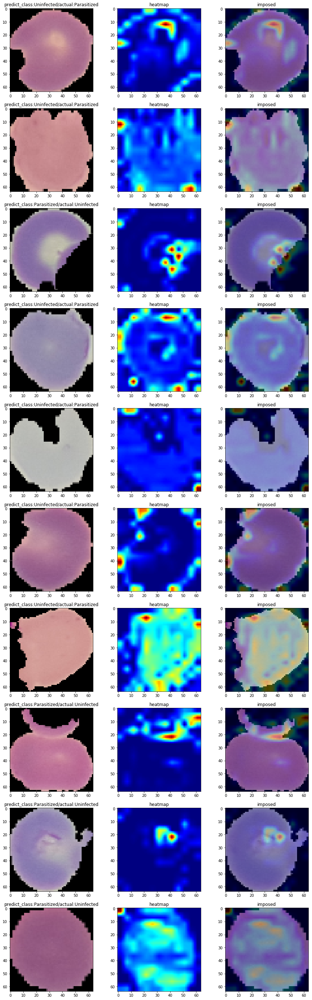

# Machine Learning Engineer Nanodegree

## Capstone Project
Huan-Wei Wu  
May 28st, 2019

## I. Definition


### Project Overview
Malaria is a mosquito-borne infectious disease that affects humans and other animals, which causes symptoms that typically include fever, tiredness, vomiting and headaches. In severe cases it can cause yellow skin, seizures, coma, or death. According to WHO data: In 2017, an estimated 219 million cases of malaria occurred worldwide and cause 435 000 deaths. Most cases were in the WHO Africa Region.

Malaria is caused by Plasmodium parasites. The parasites are spread to people through the bites of infected female Anopheles mosquitoes.

According to CDC U.S., microscopy examination remains the "gold standard" for laboratory confirmation of malaria. By visually inspecting the blood smear specimen collected from patient under the microscopy , the laboratorians can determined if this patient is infected. However, the proficiency of laboratorias becomes a problem.

ref:  

1. <https://www.who.int/news-room/fact-sheets/detail/malaria>
2. <https://en.wikipedia.org/wiki/Malaria>
3. <https://www.who.int/malaria/en/>
4. <https://www.cdc.gov/malaria/diagnosis_treatment/diagnostic_tools.html#tabs-2-1>


### Problem Statement

Following previous discussion, we can say that:

1. In  some non-tropical regions , malaria became rare (average 1700 cases in ths U.S per year), the laboratorians does not perform this test regularly.
2. In some regions which are lack of medical resources (also suffered the most), well-trained Medical personnel who are able to justify test result, also hard to find.

We can implement machine learning on classifying the microscopy images ,make the justification much more easier for medical personnel who may not so familiar with this task. This could make  malaria diagnosis faster and easier to execute. 

Our goal is to build a model with good accuracy and easy to deploy in end devices (in other words : light-weighted).  CNN like structures has prove it's capability in images classification task, so we choose CNN base models for this task.

First we split the data into train/test/split sets and resize/normalize to suitable format as model input. Then we train/tune a model with some technique focused on reducing weights, pick the one with best performance on validation set and test on test sets.


### Metrics

Since our data source is categorical balanced (equal instances for parasitized/uninfected ) , accuracy should be ok for the model evaluation . We can also put precision/recall into consideration too (focus on better recall score, because it's more important for disease detection). Confusion matrix as follow: (parasitized : positive,  uninfected : negative in this case).

|                                  | **Condition positive**  | **Condition Negative**  |
| :------------------------------- | ----------------------- | ----------------------- |
| **Predicted condition positive** | True Positive ( *tp* )  | False Positive ( *fp* ) |
| **Predicted condition negative** | False Negative ( *fn* ) | True Negative ( *tn* )  |


$$
accuracy = \frac{tp+tn}{tp+tn+fp+fn}  \\ 
precision = \frac{tp}{tp+fp} \\
recall = \frac{tp}{tp+fn}
$$
ref : <https://en.wikipedia.org/wiki/Precision_and_recall>

<div STYLE="page-break-after: always;"></div>

## II. Analysis

**_(approx. 2-4 pages)_**

### **Data Exploration**/Exploratory Visualization

Here we using Malaria Cell Images Dataset on kaggle (<https://www.kaggle.com/iarunava/cell-images-for-detecting-malaria>),  origin from NIH U.S (<https://ceb.nlm.nih.gov/repositories/malaria-datasets/>).

According to the descriptions : "Giemsa-stained thin blood smear slides from 150 P. falciparum-infected and 50 healthy patients were collected and photographed at Chittagong Medical College Hospital, Bangladesh. The datasets contains a total of 27,558 cell images with equal instances of parasitized and uninfected cells."

First, we print out some random choose images for both category :


<div STYLE="page-break-after: always;"></div>

We can see that, the cell images with deep-purple regions shape likes dot/ring/half-moon/letter c, usually means the cell is infected. (more information  about  P. falciparum identification : <https://www.cdc.gov/dpdx/resources/pdf/benchAids/malaria/Pfalciparum_benchaidV2.pdf>)

We can also look at some image densities distribution, since our images comes from Giemsa-stained blood smear slides, for each image we can see certain color (blue or red) has higher intensities distribution than others.


<div STYLE="page-break-after: always;"></div>

Next we investigated the distribution of images sizing :

 

 As the figure shows, the size distributed normally from 50~200 squared pixels and there are no big difference between X/Y length so we can overall resize image to 64X64 for computational cost. 


<div STYLE="page-break-after: always;"></div>

### **Algorithms and Techniques**
Since we are going to do image classification, a CNN base model will be a reasonable  choice.

Here propose a model building base on following features (light-weighted is prefer): 

1. Constructed only by separable convolution layers with *'selu'* activation:

   - *'selu'* activation :  The basic idea behind this activation function is to normalize the output value (act similar to batch normalization) , while keeping the neuron from dead compared to *'relu'*. 
     $$
     % <![CDATA[
     f(x) = 
         \begin{cases}
             x, & \text{if } x > 0 \\
             \alpha (e^{x} -1), & \text{if } x \leq 0
          \end{cases} %]]>
     $$
     ( ref:  <https://arxiv.org/pdf/1706.02515.pdf >) 

   - Separable convolutions : separate the classic convolution process into spatial convolution (each channel with a different 2D-filter)+ point-wise convolution ( 1\*1\*channel_size convolution). This reduce overall redundant computation cost and also prevent over-fitting.

     (ref:<https://arxiv.org/pdf/1704.04861.pdf>)

   - No max-pooling layer between convolution layers : Instead, use separable convolution layers with strides=2 to reduce feature map (increase parameters, but less information loss).

   - No dropout for convolution layers : dropout is widely used in fc layers for over-fitting prevention, but not very useful between convolution layers because :

     1. Convolution layers has much less parameters compare to fc layers.

     2. Convolution feature maps encoded from local information, dropout may hurt this. 

     (ref:<https://towardsdatascience.com/dont-use-dropout-in-convolutional-networks-81486c823c16>)

     

   

2. Global average pooling layer on top of that before a dense *softmax* layer for output. This is used  to replace traditional dense layers locate before *softmax* layer which is easily over-fitting.

    (Act as a structural regularizer to prevent over-fitting reduction, <https://arxiv.org/pdf/1312.4400.pdf> ) 

<div STYLE="page-break-after: always;"></div>

**Model summary** :

As follows, we can see the model only contains 4253 parameters (which is quite few compares to other classic models, for ex : MobileNet V2 has 4,253,864 parameters)

```
Layer (type)                 Output Shape              Param #   
=================================================================
separable_conv2d_1 (Separabl (None, 62, 62, 32)        155       
_________________________________________________________________
separable_conv2d_2 (Separabl (None, 30, 30, 32)        1344      
_________________________________________________________________
separable_conv2d_3 (Separabl (None, 28, 28, 32)        1344      
_________________________________________________________________
separable_conv2d_4 (Separabl (None, 13, 13, 32)        1344      
_________________________________________________________________
global_average_pooling2d_1 ( (None, 32)                0         
_________________________________________________________________
dense_1 (Dense)              (None, 2)                 66        
=================================================================
Total params: 4,253
Trainable params: 4,253
Non-trainable params: 0
```


**Training optimizer** : 

1. Using SGD with momentum & Nesterov acceleration , lr=0.02, decay=1e-6,momentum=0.9, train for 50 epochs.

   Nesterov acceleration : for each gradient descend step, follow momentum first then compute gradients from there (implementation in current modules are slightly changed to prevent compute forward propagation +back propagation twice in a step).

   (ref:<http://cs231n.github.io/neural-networks-3/)>

2. Use callback function to save/load model with best val_accuracy (early_stopping).


### Benchmark

After surveyed several report, the reported accuracy of microscopy method is around 93~95% , the model should be comparable to that (Although the data source is different in these cases).  

Also, several transfer learning models implementation done by fastai as benchmarks : 

1. Pre-trained resnet50/dense121/vgg16_bn, with trainable top layer(GAP)
2. Image resize to fit the pre-trained model request (224*224)
3. Same augmentation on train data as custom model
4. Trained for 5 cycles with one-cycle-policy.

> 
>
> one-cycle-policy (pictures from <https://docs.fast.ai/callbacks.one_cycle.html#What-is-1cycle?>, the iteration depends on sample/batch size)


ref:

1. <https://www.hindawi.com/journals/jpr/2019/1417967/>
2. <https://www.ncbi.nlm.nih.gov/pubmed/19407111>
3. https://sgugger.github.io/the-1cycle-policy.html>)

<div STYLE="page-break-after: always;"></div>


## **III. Methodology**


### **Data Preprocessing**


The datasets was random split in ratios around 0.8/0.1/0.1  with roughly equal instances of parasitized and uninfected images for train/validation/test use.

Custom model : 

1. Resize all images to 64*64 and normalized to 0~1 (divided by 255).  We knows that resizing image to bigger one will not increase the information carried by images, so this is for computational effectiveness and base on the size distribution of images.

2. Image augmentation with vertical/horizontal flips , image augmentation only implemented for training data. 

> The reason for flips only is that as the images shows, many of the important features(deep-red zones) locate at edge, which means the rotation/shift augmentation will induce distortion/missing for these features, therefore impact the training process.) 

Benchmark models:

1. resize image to 224 (matching pre-trained model input), and normalization by datasets' mean/variance.
2. Image augmentation with vertical/horizontal flips , image augmentation only implemented for training data. 

### **Implementation**
This project all executed on kaggle kernel (with GPU) , the detailed docker image informations : 

 <https://github.com/Kaggle/docker-python>

For custom model : 

- The data augmentation/model building/training/evaluation all done by using *keras* (tensorflow backend),the final model summary as follow:

```
Layer (type)                 Output Shape              Param #   
=================================================================
separable_conv2d_1 (Separabl (None, 62, 62, 32)        155       
_________________________________________________________________
separable_conv2d_2 (Separabl (None, 30, 30, 32)        1344      
_________________________________________________________________
separable_conv2d_3 (Separabl (None, 28, 28, 32)        1344      
_________________________________________________________________
separable_conv2d_4 (Separabl (None, 13, 13, 32)        1344      
_________________________________________________________________
global_average_pooling2d_1 ( (None, 32)                0         
_________________________________________________________________
dense_1 (Dense)              (None, 2)                 66        
=================================================================
Total params: 4,253
Trainable params: 4,253
Non-trainable params: 0
_________________________________________________________________
```

- The custom model was trained for 50 cycles with SGD(with Nesterov acceleration), save the model with best validation accuracy after each training epoch and load the weights as final model. SGD training sometimes goes wild and fail to converge in short time, re-initialize and re-start the training process is needed.

For transfer learning benchmark models:

- The data augmentation/model building/training/evaluation all done by using *fastai*.  We trained 3 models (DenseNet121/ResNet50/VGG16 with batch normalization) with one-cycle-policy for 5 cycles, as benchmarks to our custom model.


> This was because after recently update of *keras*, the build in Batch-Normalization layers, will using mini-batch statistics while training, but using pre-trained statistics while testing. If the learning datasets statistics are very different from pre-train datasets(in this case, the cell images are quite different compare to *imagenet* sets.), that leads to big discrepancy between train/test condition.
>
> So I decide to choose faster also stronger(compare to what I can do) implementation by fastai for bench mark models making.
>
> ref : <https://blog.datumbox.com/the-batch-normalization-layer-of-keras-is-broken/>

 

The test process was done by accuracy/precision/recall score function imported from *sklearn* library.

The Grad-Cam implementation modified from: <http://www.hackevolve.com/where-cnn-is-looking-grad-cam/>

1. According to formula provided in original paper(<https://arxiv.org/abs/1610.02391>),the operation of convolution value of each feature map was 'sum' (not 'mean') before feed to 'relu' function.
2. Heat-map normalizing was done by scale the [maximum.minimum] to [0,255] for each heat-map (just for enlarge the output contrast).
3. After applied color-map to generate heat-map, needs to transfer from BGR to RGB before ploting by *matplotlib*  (the default channel arrangement for *opencv2* is BGR, *matplotlib* is RGB).

 

### **Refinement**

1. First layer using standard convolution or separable convolution (with same output channel size) shows no big difference.

   | lr : 0.02,batch_size:32      | val_accuracy |
   | ---------------------------- | ------------ |
   | First layer Con2D            | 0.9556       |
   | First layer Separable Conv2D | 0.9560       |

   

2. Reduce batch size helps improve model accuracy around 1% ,batch size can treat as an regulator during training , the smaller the batch the more noise in one update (some how like the central limit theorem, the more samples picked, the narrower distribution of sample mean) but also means more chances to find global minimum.

   |                              | val_accuracy                    |
   | ---------------------------- | ------------------------------- |
   | lr : 0.05, batch_size: 64/32 | fail to converge (in 50 epochs) |
   | lr : 0.01, batch_size:64     | 0.9475                          |
   | lr : 0.01, batch_size:32     | 0.9533                          |
   | lr : 0.02, batch_size:32     | 0.9581                          |

3. Remove rotation augmentation in preprocess improve overall accuracy around 1% (due to key feature loss through rotation transform in some images, result in wrong labels). 

<div STYLE="page-break-after: always;"></div>


## **IV. Results**


### **Model Evaluation and Validation**

First, look at the training curve of final model (accuracy vs epoch), the val_accuracy keep up with training accuracy, means the over-fitting probability is quite low.


At first, 10% data was split as test set, to check the model performance to unseen data, the following table shows test accuracy/precision/recall score for final custom model : 

|              | Test Accuracy | Precision | Recall |
| ------------ | ------------- | --------- | ------ |
| Custom Model | 0.9573        | 0.9702    | 0.9353 |


### **Justification**

Compare to reported accuracy of microscopy result,which was around 93~95%,  this custom model looks quite comparable to that. 

This custom model only has 4253 parameters, which makes the inference much easier in some weaker mobile devices. Suitable for medical usage in resource lacking regions.

Compare our custom model with several transfer learning models, looks slightly fall behind (these benchmark model still has fine tune potential).

|              | Test Accuracy | Precision | Recall |
| ------------ | ------------- | --------- | ------ |
| Custom Model | 0.9573        | 0.9693    | 0.9432 |
| ResNet50     | 0.9601        | 0.9687    | 0.9489 |
| Dense121     | 0.9612        | 0.9709    | 0.9489 |
| VGG16_BN     | 0.9558        | 0.9608    | 0.9482 |


## **V. Conclusion**
### **Free-Form Visualization**
We implement Grad-Cam to check if our model really focus on reasonable features, here shows some random sample Grad-Cam images, we can see that model can focus on the deep purple region in images.

(ref: <http://www.hackevolve.com/where-cnn-is-looking-grad-cam/>)





<div STYLE="page-break-after: always;"></div>

We also check some images that was classified  error by model :

<div STYLE="page-break-after: always;"></div>

### **Reflection**

To summarize this whole project :

1. First, split the data for train/validation/test use.
2. Trying different way in building custom model and test the effect of image augmentation/preprocess.
3. Pick model with best validation accuracy and check several Grad-Cam images to make sure model works reaonably.
4. Use *fastai* library to implement transfer learning as benchmark models.
5. Compare the performance of custom model with these benchmark models.

Result : 

My initial motivation is building a light-weighted model with comparable accuracy, so I choose many technique with parameters reduction to build model and this result looks quite acceptable.

Notice :

- Doing deep learning with high-ends library needs to be careful : in this case, the images mean/variance are quite different with *imagenet* image sets (actually I didn't do the calculation, but it's quite obvious) , which was used in most pre-trained model. 

- After I followed the transfer learning procedure learned in previous lesson (same as the example provided in the *keras* documents)  and stuck in the batch-normalization problem mentioned before, I had to choose from:

  - Write custom functions by tensor-flow or implement the custom solution provided by others.
  - Do the benchmark models by other API.

  Considered my coding capability and remain time,  I choose trained these model by *fastai* library and had the chance to look at the some more state of art techniques:

  - The power of one-cycle-policy, the validation accuracy can improve to >95% in less than 5 epochs. 
  - The easy implementation and strong result by *fastai* library, easily exceed my custom model. (still, the easier the implementation, the more black-boxed details needs to be understand before use).

- SGD sometimes goes wild , and need lots of time to come back, re-initialize helps.

### **Improvement**

- From the bench models experience, by implement one-cycle-policy during training, I might be able to test more hyper-parameters and with better results (needs to write custom learning rate scheduler in *keras*).
- Transfer learning results shows current model is not at state of art performance ceiling , by re-design model architecture, improvement still quite possible (but the model may become "heavier").

